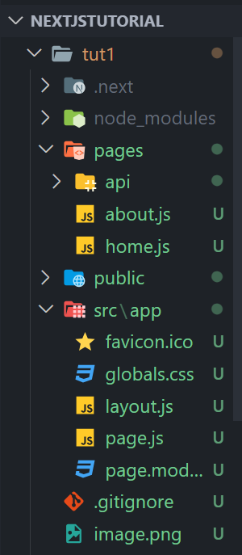
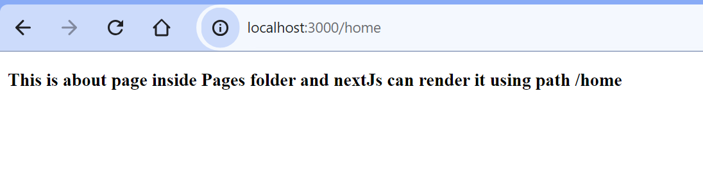
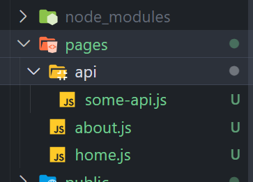
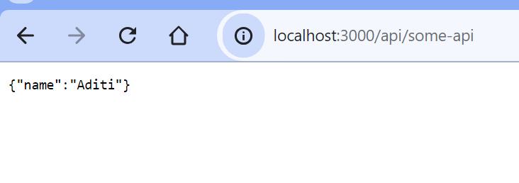

This is a [Next.js](https://nextjs.org/) project bootstrapped with [`create-next-app`](https://github.com/vercel/next.js/tree/canary/packages/create-next-app).

## Getting Started
To Install 

    npx create-next-app@latest 

### Make a Pages Folder
+ If we make a file in pages folder like home.js or about.js or aditi.js
+ and then in our url we write localhost//:3000/home 
+ then hone.js data will be displayed automatically 
+ so like in React Js we needed react-router-dom so in NextJs it is in built
+ so whatever file we make in pages folder we can render it by going on route with file name
  




### Make a Api Folder inside Pages Folder

+ If we make a file in api folder inside pages folder then we can create our apis directly
+ like just write api/login or api/register or api/home 
+ just remember that after api the name of file should come and json data will be shown on browser
  





First, run the development server:

```bash
npm run dev
# or
yarn dev
# or
pnpm dev
# or
bun dev
```

Open [http://localhost:3000](http://localhost:3000) with your browser to see the result.

You can start editing the page by modifying `app/page.js`. The page auto-updates as you edit the file.

This project uses [`next/font`](https://nextjs.org/docs/basic-features/font-optimization) to automatically optimize and load Inter, a custom Google Font.

## Learn More

To learn more about Next.js, take a look at the following resources:

- [Next.js Documentation](https://nextjs.org/docs) - learn about Next.js features and API.
- [Learn Next.js](https://nextjs.org/learn) - an interactive Next.js tutorial.

You can check out [the Next.js GitHub repository](https://github.com/vercel/next.js/) - your feedback and contributions are welcome!

## Deploy on Vercel

The easiest way to deploy your Next.js app is to use the [Vercel Platform](https://vercel.com/new?utm_medium=default-template&filter=next.js&utm_source=create-next-app&utm_campaign=create-next-app-readme) from the creators of Next.js.

Check out our [Next.js deployment documentation](https://nextjs.org/docs/deployment) for more details.
